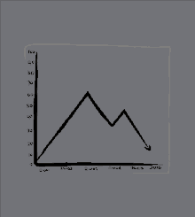

# Transform-and-numerical-methode
Math library that contain functions  Bisection method , Newton-Raphson  method, Regular -Falsi method, and secant method.



## MANUAL

TO impelment any function of this package just use the function name and parameters required
first paprameter is f: f denotes the function on which the approximation is to be applied (will be the must and first parameter of all functions.

# Other Parameters to be used are mentioned below:

*  Bisection methode :
   
         
        bi_mthd(f, a, b)  
  
    a: second parameter which will be the left end point of the interval <br>
    b: third parameter which will be the right end point 

* Newton-Raphson methode :      
    ``` 
    newton_raphson(f, df, x0)
     ```
     
  
  df: second parameter which will be the derivative of the function<br>
  x0: third parameter which is the intial guess 

  tol: is the fourth parameter denoting tolerence for the root which is predefined but can be changed as per usage <br>
  max_iter: is the fifth and the last parameter which is already set to 100 iterations

* Regular Falsi methode :           
  
   ```
  regula_falsi(f, a, b)   
   ```
  
  a: second parameter which will be the left end point of the interval<br>
  b: third parameter which will be the right end point 

  tol: is the fourth parameter denoting tolerence for the root which is predefined but can be changed as per usage <br>
  max_iter: is the fifth and the last parameter which is already set to 100 iterations


* Secant methode:
   ```  
   scnt_mthd(f, x0, x1)
   ```
  
  x0: second parameter which will be the first intial guess<br>
  x1: third parameter which will be the second intial guess

  tol: is the fourth parameter denoting tolerence for the root which is predefined but can be changed as per usage <br>
  max_iter: is the fifth and the last parameter which is already set to 100 iterations
  
  ## Contributing

Pull requests are welcome. For major changes, please open an issue first
to discuss what you would like to change.

Please make sure to update tests as appropriate.

## License

[MIT](https://choosealicense.com/licenses/mit/)
